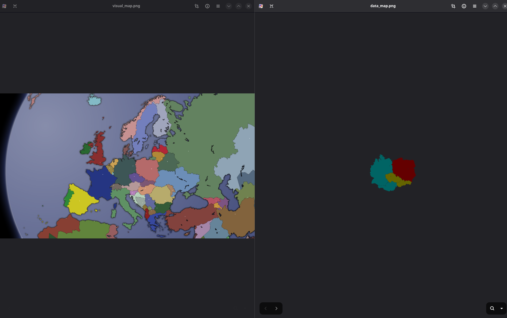
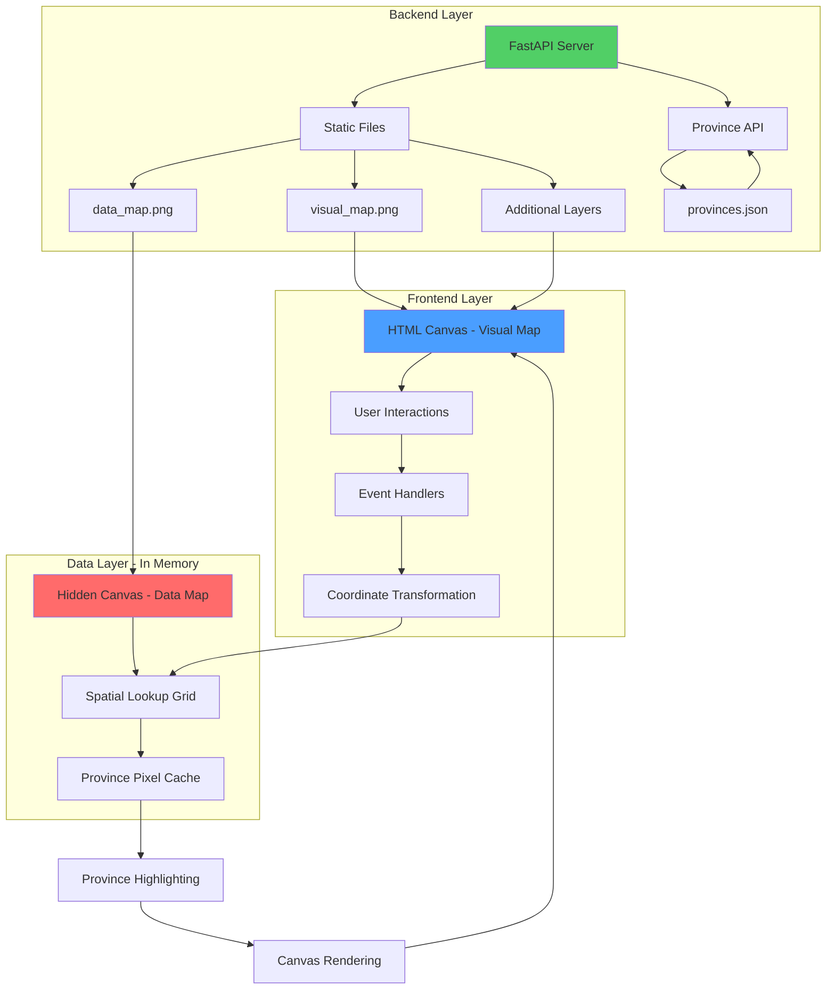
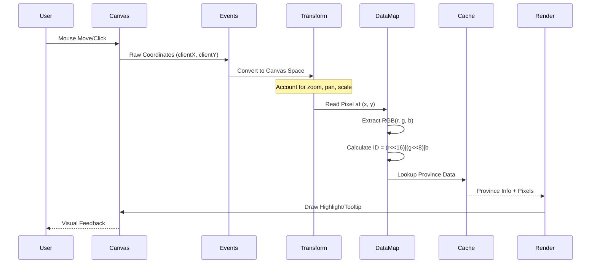
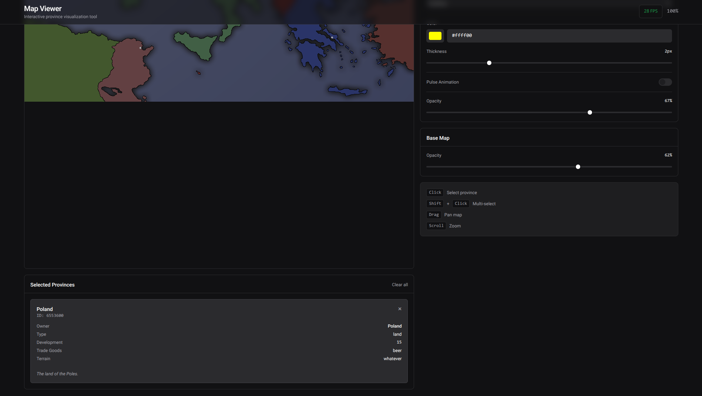
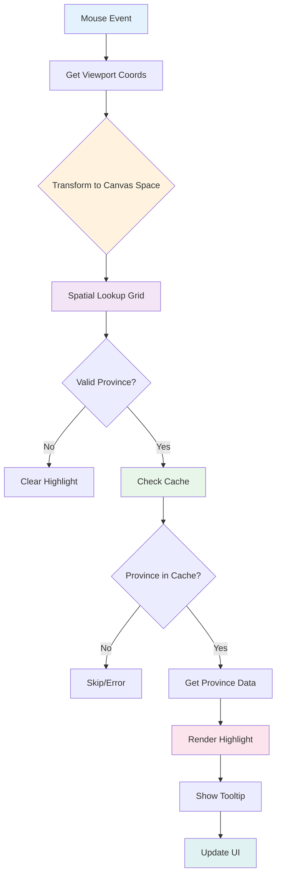
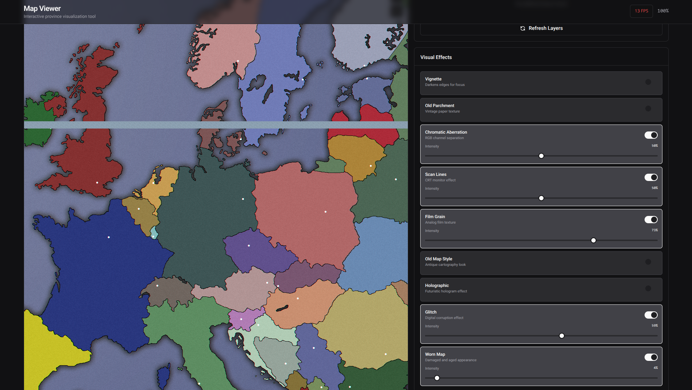

# Clausewitz-Style Web Map Projection




A high-performance web-based implementation of province map projection using invisible bitmap data layers, inspired by Paradox Interactive games (Europa Universalis, Crusader Kings, etc.). This project demonstrates how to create interactive maps where users see a beautiful, stylized visual map while the application uses a hidden data layer for precise province identification.

## Overview

This repository showcases a technique for creating interactive web maps that work similarly to strategy games like Europa Universalis IV or Crusader Kings III. The core concept involves using two separate map layers:

1. **Visual Map** - The beautiful, stylized map that users see and interact with
2. **Data Map** - An invisible bitmap where each province is represented by a unique color

When a user clicks or hovers over the visual map, the application reads the corresponding pixel from the hidden data map to identify which province was selected.

>[!NOTE]
>This project was developed with the help of AI coding assistants. The purpose of this repository is not to showcase my own programming skills, but to demonstrate how to achieve an effect similar to the maps found in Paradox Interactive games (Europa Universalis, Crusader Kings, etc.) using web technologies.
> Before using this code in a production environment, I encourage you to thoroughly review and validate it yourself.


## Architecture Overview



## How It Works

### The Two-Layer System

The technique relies on maintaining two separate map images:

- **`visual_map.png`** - The aesthetic map displayed to users (terrain, borders, cities, etc.)
- **`data_map.png`** - A "key map" where each province is painted with a unique RGB color

### Province Detection Flow



### Implementation Methods

The data layer must be completely invisible to the user. This project uses the **In-Memory Canvas** approach (preferred method):

#### In-Memory Canvas Implementation

A cleaner approach where the data canvas is created entirely in JavaScript memory:

```javascript
// Create image for data map
const dataImg = new Image();
dataImg.src = '/static/data_map.png';

// Create virtual canvas in memory only
const dataCanvas = document.createElement('canvas');
const dataCtx = dataCanvas.getContext('2d', { willReadFrequently: true });

// Once image loads, set dimensions and draw
dataImg.onload = () => {
    dataCanvas.width = dataImg.width;
    dataCanvas.height = dataImg.height;
    dataCtx.drawImage(dataImg, 0, 0);
    // Now dataCtx is ready for pixel reading via getImageData(x, y, 1, 1)
};
```

This `dataCanvas` exists only as a JavaScript variable and is never added to the DOM, making it completely invisible to users. The `willReadFrequently: true` option optimizes the context for frequent `getImageData()` calls.

### Province ID Calculation

Province IDs are calculated from RGB color values using bit shifting:
```javascript
provinceId = (r << 16) | (g << 8) | b
```

This allows up to 16,777,216 unique province IDs (24-bit color space). Invalid provinces (pure black `RGB(0,0,0)`, pure white `RGB(255,255,255)`, or ID 0) are filtered out.

**Example Province ID Encodings:**
- Province 1 = RGB(0, 0, 1) → ID = 1
- Province 256 = RGB(0, 1, 0) → ID = 256
- Province 65536 = RGB(1, 0, 0) → ID = 65536
- Province 16777215 = RGB(255, 255, 255) → ID = 16777215 (invalid - filtered out)

## Step-by-Step Province Detection Process

This section details exactly how a single mouse position is converted into a province selection:

### 1. Mouse Event Capture
```javascript
visualCanvas.addEventListener('mousemove', handleMouseMove);
```
When the user moves their mouse over the visible canvas, the browser fires a `mousemove` event with coordinates relative to the viewport (`event.clientX`, `event.clientY`).

### 2. Viewport to Canvas Transformation
```javascript
function getCanvasCoordinates(event) {
    const rect = visualCanvas.getBoundingClientRect();
    const x = event.clientX - rect.left;
    const y = event.clientY - rect.top;
    
    // Account for CSS transforms (zoom/scale)
    const scaleX = baseWidth / rect.width;
    const scaleY = baseHeight / rect.height;
    
    const canvasX = Math.floor(x * scaleX);
    const canvasY = Math.floor(y * scaleY);
    
    return { canvasX, canvasY };
}
```

**Why this step is necessary:**
- The canvas may be zoomed or scaled via CSS transforms
- `getBoundingClientRect()` returns the actual rendered size
- We need to convert back to the original pixel coordinates

### 3. Spatial Lookup Grid Query (O(1))
```javascript
function getProvinceAtPosition(x, y) {
    if (x < 0 || x >= dataCanvas.width || y < 0 || y >= dataCanvas.height) {
        return null;
    }
    const index = y * dataCanvas.width + x;
    return provinceLookupGrid[index]; // O(1) lookup
}
```

**Optimization:** Instead of calling `getImageData()` every time (expensive), we pre-compute a `Uint32Array` where each element stores the province ID for that pixel. This reduces lookup time from O(n) to O(1).

### 4. Province Validation
```javascript
function isValidProvince(provinceId, r, g, b) {
    if (provinceId === 0) return false;
    if (r === 0 && g === 0 && b === 0) return false;
    if (r === 255 && g === 255 && b === 255) return false;
    return true;
}
```

Filters out water, unmapped areas, and invalid regions.

### 5. Cache Lookup
```javascript
const cached = provincePixelCache.get(provinceId);
if (!cached) return; // Province not in cache

// Cached data includes:
// - fill: Array of all pixels in the province
// - outline: Lazy-computed border pixels
```

The cache stores pre-computed pixel arrays for each province, avoiding expensive iteration through the entire map.

### 6. Province Data Retrieval
```javascript
const provinceData = provincesData[provinceId.toString()];
// Returns: { name, owner, type, development, trade_goods, terrain, description }
```

Province metadata is loaded from `provinces.json` via the FastAPI backend.

### 7. Visual Feedback
```javascript
// A) Highlight the province
currentHoveredProvinceId = provinceId;
redrawMap(); // Draws highlight overlay

// B) Show tooltip
showTooltip(event, provinceId, provinceData);
```



The province is highlighted on the visual canvas, and a tooltip appears near the cursor.

### Complete Detection Pipeline



### Performance Characteristics

| Operation | Time Complexity | Notes |
|-----------|----------------|-------|
| Mouse Event → Canvas Coords | O(1) | Simple arithmetic |
| Spatial Lookup | O(1) | Pre-computed `Uint32Array` |
| Province Validation | O(1) | Simple comparisons |
| Cache Lookup | O(1) | `Map.get()` operation |
| Highlight Rendering | O(p) | Where p = pixels in province (cached) |

**Total Time:** O(p) where p is typically small (<10,000 pixels for most provinces)

### Performance Optimizations

The implementation includes several critical optimizations:

1. **Spatial Lookup Grid**: Pre-computed `Uint32Array` mapping every pixel to its province ID
   - Initialization: O(n) where n = total pixels
   - Lookup: O(1)
   - Memory: 4 bytes per pixel (e.g., 8MB for 2048×1024 map)

2. **Province Pixel Cache**: Pre-computed pixel arrays for each province
   - Stores: `{ fill: Array<{x, y}>, outline: Array<{x, y}> }`
   - Initialization: O(n) during map load
   - Access: O(1)

3. **Canvas Cache**: Rendered province highlights are cached as separate canvas elements
   - Key: `${provinceId}-${mode}-${color}-${thickness}`
   - Avoids re-rendering the same province multiple times
   - Max cache size: 100 entries

4. **Lazy Border Computation**: Province borders are only computed when outline mode is first used
   - Reduces initial load time
   - Memory freed after computation

5. **Throttled Events**: Mouse move events are throttled to 16ms (~60fps)
   ```javascript
   const handleMouseMove = throttle(function(event) { ... }, 16);
   ```

6. **Optimized Context Options**: 
   - Visual canvas: `{ willReadFrequently: false }` (write-heavy)
   - Data canvas: `{ willReadFrequently: true }` (read-heavy)

7. **Effect Optimizations**:
   - Film Grain: Process every 4th pixel
   - Parchment: Process every 2nd pixel
   - Chromatic Aberration: Reduced offset calculation
   - Old Map: Simplified gradient calculations

## Technology Stack

- **Backend**: FastAPI (Python) - High-performance async API server
- **Frontend**: HTML5 Canvas with Vanilla JavaScript - No framework overhead
- **Styling**: Tailwind CSS 3.x - Utility-first CSS with custom theme
- **UI Libraries**: 
  - SortableJS 1.15.0 - Drag and drop for layer reordering
- **Map Images**: PNG format for both visual and data layers
- **Performance**: RequestAnimationFrame for 30fps animation loop

## Project Structure

```
.
├── README.md
├── main.py               # FastAPI application
├── provinces.json        # Province data (names, owners, stats, etc.)
├── static/
│   ├── visual_map.png    # The beautiful map users see
│   ├── data_map.png      # The invisible key map
│   ├── *_map.png         # Optional additional layers
│   └── map.js            # Main JavaScript application logic (optimized)
├── templates/
│   └── index.html        # Frontend HTML with Tailwind CSS
└── pyproject.toml        # Python dependencies (FastAPI, uvicorn)
```

## Key Features

### Core Functionality
- **Dual-layer map system** (visual + data) with invisible data layer for province identification
- **FastAPI backend** for serving map assets and province data via REST API
- **Interactive province selection** via mouse events (click, shift+click for multi-select)
- **Efficient pixel-based province lookup** using O(1) spatial lookup grid
- **Province highlighting** on hover with customizable fill or outline modes
- **Interactive tooltips** showing province information (name, owner, stats, description)
- **Zoom and pan controls** with mouse wheel (20%-500%) and drag support

### Visual Effects System (9 Effects)
- **Vignette** - Darkens edges for focus
- **Old Parchment** - Vintage paper texture with sepia tone (optimized)
- **Chromatic Aberration** - RGB channel separation (optimized)
- **Scan Lines** - CRT monitor effect
- **Film Grain** - Analog film texture (optimized, every 4th pixel)
- **Old Map Style** - Antique cartography look (optimized)
- **Holographic** - Futuristic hologram effect with animated waves (optimized)
- **Glitch** - Enhanced digital corruption with RGB split, tears, and color blocks
- **Worn Map** - Realistic damage with tears, holes, stains, scratches, and fold lines



Each effect:
- Can be toggled independently
- Has intensity control (0-100%)
- Can be combined with other effects
- Optimized for 30fps+ performance

### Advanced Features
- **Map layers system** - Dynamically load and layer multiple PNG overlays
  - Auto-detection of `*_map.png` files in `static/` directory
  - Drag-and-drop reordering via SortableJS
  - Individual opacity control per layer
- **Selected provinces panel** - Detailed view of all selected provinces with full metadata
- **Pulse animation** - Animated opacity for both fill and outline highlight modes
- **Opacity controls** - Independent control for base map and highlights
- **FPS counter** - Real-time performance monitoring with color coding:
  - Green: ≥25 FPS (good performance)
  - Yellow: 20-24 FPS (slight lag)
  - Red: <20 FPS (performance issues)
- **Modern UI** - Minimalist design inspired by shadcn/ui with dark theme
- **Responsive layout** - Adapts to different screen sizes
- **Author footer** - Credits with GitHub link

### Performance Features
- **Throttled mouse events** (16ms interval)
- **Canvas caching** (up to 100 cached highlights)
- **Lazy computation** (borders computed on-demand)
- **Optimized effects** (pixel skipping, simplified algorithms)
- **RequestAnimationFrame** loop (30fps target)

## Use Cases

This technique is ideal for:
- Strategy game web interfaces
- Interactive historical maps
- Geographic data visualization
- Educational map applications
- Political/economic data overlays
- Any scenario requiring precise region selection on stylized maps

## Why This Approach?

The invisible bitmap technique should offer several advantages:

- **Precise Selection**: Pixel-perfect province identification without complex polygon calculations or path tracing
- **Performance**: Fast O(1) lookups using pre-computed spatial grid
- **Flexibility**: Easy to update provinces by regenerating the data map
- **Separation of Concerns**: Visual design is completely independent from interaction logic
- **Scalability**: Works efficiently even with 1000+ provinces
- **Memory Efficient**: ~4 bytes per pixel + cached province data
- **No External Libraries**: Pure Canvas API, no complex geometry libraries needed

### Performance Comparison

| Method | Lookup Time | Memory | Flexibility |
|--------|-------------|--------|-------------|
| Bitmap (This Project) | O(1) | ~8MB (2K map) | High |
| SVG Paths | O(n log n) | ~100KB | Medium |
| Polygon Hit Testing | O(n) | ~500KB | High |
| Tile-based | O(1) | ~50MB | Low |

## Getting Started

### Prerequisites

- Python 3.8+
- pip or uv

### Installation

1. **Clone the repository:**
```bash
git clone https://github.com/SirCypkowskyy/clausewitz-style-web-map-projection.git
cd clausewitz-style-web-map-projection
```

2. **Install dependencies:**
```bash
pip install -e .
```
or if using `uv`:
```bash
uv sync
```

3. **Place your map images:**
   - Add `visual_map.png` to `static/` directory (your beautiful map)
   - Add `data_map.png` to `static/` directory (each province with unique RGB color)
   - Optionally add additional map layers (e.g., `political_map.png`, `terrain_map.png`)
   - Layer files must contain "map" in filename and be PNG format

4. **Run the FastAPI server:**
```bash
uvicorn main:app --reload
```
or simply:
```bash
python main.py
```

5. **Open your browser:**
```
http://localhost:8000
```

The application will:
- Load both map images
- Pre-compute the spatial lookup grid (~2 seconds for 2K map)
- Cache province pixels
- Display the interactive map

## Creating the Data Map

The data map ([`data_map.png`](./static/data_map.png)) is critical for province detection. It must:

### Requirements
- Have the **exact same dimensions** as the visual map (pixel-perfect alignment)
- Use **unique RGB colors** for each province (no color collisions)
- Be **pixel-aligned** with the visual map (provinces must match exactly)
- Use colors that are **distinct enough** to avoid float/rounding errors
- Saved as **PNG format** (lossless, no JPEG artifacts)

### Province ID Encoding

The province ID is calculated as: **`ID = (R << 16) | (G << 8) | B`**

This means:
- Each unique RGB color maps to exactly one province
- Colors must be unique across the entire map

### Example Color Assignments

```python
# Simple sequential assignment
province_1_color = (0, 0, 1)    # RGB(0, 0, 1)   → ID = 1
province_2_color = (0, 0, 2)    # RGB(0, 0, 2)   → ID = 2
province_3_color = (0, 0, 3)    # RGB(0, 0, 3)   → ID = 3
# ... continue sequentially

# Or use a generator:
def get_province_color(province_id):
    r = (province_id >> 16) & 0xFF
    g = (province_id >> 8) & 0xFF
    b = province_id & 0xFF
    return (r, g, b)
```

### Invalid/Reserved Colors

The following colors are treated as **invalid** and will be ignored:

- ❌ Pure black: `RGB(0, 0, 0)` - typically water/ocean
- ❌ Pure white: `RGB(255, 255, 255)` - background/unmapped
- ❌ Any color resulting in province ID `0`

### Recommended Workflow

1. Create your visual map in your preferred graphics software
2. Duplicate the layer structure
3. Fill each province with a unique color using the formula above
4. Export as PNG (lossless, no compression artifacts)
5. Verify pixel alignment between visual and data maps
6. Test with the application

### Tools for Creating Data Maps

- **GIMP/Photoshop**: Manual painting with color picker
- **Paint.net/Pinta**: Fast, quick changes
- **Custom Scripts**: Convert from polygon data to raster

## Province Data Format

Province data is stored in `provinces.json` with the following structure:

```json
{
  "provinces": {
    "1": {
      "id": 1,
      "name": "Province Alpha",
      "type": "land",
      "owner": "Kingdom of Example",
      "development": 15,
      "trade_goods": "grain",
      "terrain": "plains",
      "description": "A fertile province known for its agricultural output."
    },
    "256": {
      "id": 256,
      "name": "Coastal Haven",
      "type": "coastal",
      "owner": "Republic of Traders",
      "development": 20,
      "trade_goods": "fish",
      "terrain": "coastal",
      "description": "A prosperous port city."
    }
  }
}
```

### Field Descriptions

| Field | Type | Required | Description |
|-------|------|----------|-------------|
| `id` | integer | Yes | Must match the province ID from data map |
| `name` | string | Yes | Display name of the province |
| `type` | string | Yes | Province type (land, coastal, water, etc.) |
| `owner` | string | No | Current owner/controller |
| `development` | number | No | Development level (0-99) |
| `trade_goods` | string | No | Primary trade resource |
| `terrain` | string | No | Terrain type (plains, mountains, forest, etc.) |
| `description` | string | No | Flavor text or additional info |

### Handling Missing Data

The frontend gracefully handles missing data:
- Missing optional fields are simply not displayed in tooltips
- Missing entire province entries show "No data available for this province"
- The selected provinces panel displays "Unknown Province" for provinces without data

The province key in the JSON (e.g., `"1"`) is used for lookup, and the `id` field should match the province ID calculated from the RGB color using the formula: `(r << 16) | (g << 8) | b`.

## API Endpoints

The FastAPI backend provides the following RESTful endpoints:

### Web Interface
- **`GET /`** - Serves the main map interface (HTML template with Tailwind CSS)

### Province Data API
- **`GET /api/provinces`** - Returns all province data as JSON
  ```json
  {
    "provinces": {
      "1": { "id": 1, "name": "...", ... },
      "2": { "id": 2, "name": "...", ... }
    }
  }
  ```

- **`GET /api/provinces/{province_id}`** - Returns data for a specific province
  ```json
  {
    "id": 1,
    "name": "Province Alpha",
    "type": "land",
    "owner": "Kingdom of Example",
    ...
  }
  ```
  - Returns **404** if province not found

### Map Layers API
- **`GET /api/map-layers`** - Returns list of available map layer files
  ```json
  {
    "layers": [
      "political_map.png",
      "terrain_map.png",
      "trade_map.png"
    ]
  }
  ```
  - Automatically detects PNG files containing "map" in filename
  - Excludes `data_map.png` and `visual_map.png`
  - Results are sorted alphabetically

### Static Files
- **`GET /static/*`** - Serves static files (map images, JavaScript, CSS)
  - `/static/visual_map.png` - Visual map
  - `/static/data_map.png` - Data map
  - `/static/map.js` - Main JavaScript application
  - `/static/*_map.png` - Additional layers

## Interactive Features

### Province Highlighting

When you hover over a province on the map, it will be highlighted with a customizable overlay effect. The highlighting supports two modes:

#### Fill Mode
- Fills the entire province with a semi-transparent overlay
- Color: Yellow `RGB(255, 255, 100)` for hover, Gold `RGB(255, 215, 0)` for selected
- Blend mode: `lighten` for better visibility
- Works with pulse animation

#### Outline Mode
- Draws a border around the province edges
- Customizable color (color picker + hex input)
- Adjustable thickness (1-5 pixels)
- Border detection using 4-neighbor algorithm
- Thickness expansion using Manhattan distance
- Works with pulse animation

Both modes support:
- Adjustable opacity (0-100%)
- Pulse animation (sine wave, 2-second cycle)
- Cached rendering for performance

### Province Selection

The application supports sophisticated multi-selection:

- **Click**: Select a single province (clears previous selection unless shift is held)
- **Shift + Click**: Add/remove province from selection (toggle behavior)
- **Click on Empty Space**: Clear all selections
- **Clear Selection Button**: Removes all selected provinces

**Selection Behavior:**
1. Single click → Replace selection with clicked province
2. Shift + click on unselected → Add to selection
3. Shift + click on selected → Remove from selection
4. Click on water/invalid area → Clear all selections

Selected provinces:
- Highlighted in gold color
- Listed in "Selected Provinces" panel
- Show full metadata
- Persist until cleared or replaced

### Tooltips

Hovering over a province displays a tooltip near the cursor with:

**Basic Information:**
- Province name (bold, colored)
- Province ID (monospace font)

**Optional Fields (if available):**
- Owner
- Province type
- Development level
- Trade goods
- Terrain type
- Description (italic, separated)

**Tooltip Features:**
- Follows mouse cursor with 15px offset
- Auto-positions to avoid screen edges
- Dark theme with blur effect
- Appears with 50ms delay (prevents flicker)
- Hides when leaving province or moving to water

If no data is available, shows: "No data available for this province"

### Zoom and Pan

#### Zoom Controls
- **Mouse Wheel**: Scroll up to zoom in, down to zoom out
  - 20% minimum zoom (0.2x)
  - 500% maximum zoom (5.0x)
  - 10% steps per scroll
- **Zoom In Button (+)**: Zoom in by 20%
- **Zoom Out Button (−)**: Zoom out by 20%
- **Reset Button (⌂)**: Reset to 100% zoom and center position

#### Pan Controls
- **Click and Drag**: Pan the map in any direction
  - Cursor changes to "grabbing" during drag
  - Works at any zoom level
- **Automatic Bounds**: No artificial boundaries (infinite pan)

#### Transform Implementation
- Uses CSS `transform: translate() scale()` for hardware acceleration
- Transform origin at top-left (0, 0)
- Coordinate conversion accounts for zoom and pan:
  ```javascript
  canvasX = (mouseX - panX) / zoomLevel
  canvasY = (mouseY - panY) / zoomLevel
  ```

### Visual Effects

The application includes **9 optimized visual effects** that can be applied individually or combined:

| Effect | Description | Performance Impact | Optimization |
|--------|-------------|-------------------|--------------|
| **Vignette** | Darkens edges | Low | Radial gradient only |
| **Old Parchment** | Vintage paper | Medium/High | Every 2nd pixel, reduced stains |
| **Chromatic Aberration** | RGB split | Medium | Direct manipulation, small offset |
| **Scan Lines** | CRT monitor | Low | Simple stroke operations |
| **Film Grain** | Analog noise | Medium/High | Every 4th pixel |
| **Old Map Style** | Antique look | Medium | Simplified sepia |
| **Holographic** | Futuristic | Low | Simplified waves, 4px spacing |
| **Glitch** | Digital corruption | Low | Random probability-based |
| **Worn Map** | Damage/aging | Low | Controlled artifact count |

Best combo (in my opinion)? `Chromatic Aberration` + `Scan Lines` + `Glitch` + `Film Grain`.

>[!WARNING]
> Combining these effects will most definietly lower your FPS count. Be careful.

**Effect Controls:**
- Each effect has independent toggle switch
- Intensity slider (0-100%) for fine control
- Multiple effects can be active simultaneously
- Effects are applied in sequence during render loop
- Real-time FPS monitoring helps identify performance issues

**Optimization Notes:**
- Effects only run when active
- Animation loop runs at 30fps (33ms frame budget)
- Pixel-skipping techniques for expensive operations
- Simplified algorithms compared to traditional implementations

### Map Layers

The application supports **dynamic layer management** for overlaying additional maps:

**Features:**
- Automatic detection of layer files (`*_map.png` in `static/` directory)
- Drag-and-drop reordering (powered by SortableJS)
- Individual opacity control per layer (0-100%)
- Toggle visibility on/off
- Render order: bottom to top (first in list = rendered first)
- Refresh button to reload available layers

**Layer Format:**
- Must be PNG files
- Must contain "map" in filename (e.g., `political_map.png`)
- Should match visual map dimensions
- Excludes `data_map.png` and `visual_map.png`

**Supported Layer Types:**
- Political boundaries
- Terrain overlays
- Trade routes
- Resource distributions
- Religious/cultural regions
- Any custom overlay

**Usage:**
1. Place PNG files in `static/` directory
2. Click "Refresh Layers" button
3. Toggle layers on/off as needed
4. Adjust opacity for blending
5. Drag to reorder rendering sequence

### Pulse Animation

Animated opacity effect for highlighted provinces:

**Technical Details:**
- Sine wave animation: `opacity = 0.5 + 0.5 * sin(phase)`
- Frequency: 2-second cycle (0.05 phase increment per frame)
- Works with **both** fill and outline modes
- Independent toggle control
- Stops automatically when nothing is highlighted

**Behavior:**
- Only animates when provinces are selected or hovered
- Animation frame loop pauses when inactive (performance)
- Smooth 30fps animation
- Multiplies with base highlight opacity

### Performance Monitoring

**FPS Counter** in the header provides real-time performance feedback:

**Color Coding:**
- **Green**: ≥25 FPS - Good performance, smooth experience
- **Yellow**: 20-24 FPS - Minor lag, some effects may stutter
- **Red**: <20 FPS - Performance issues, reduce effects

**Behavior:**
- Updates every second
- Only active when effects or pulse animation are running
- Shows "-- FPS" when idle (no animation)
- Helps users identify performance-heavy effect combinations

**Performance Tips:**
- Disable effects if FPS drops below 20
- Reduce effect intensity before disabling
- Glitch and Worn Map effects are most expensive
- Combining 3+ effects may impact performance

### User Interface

**Design Philosophy:**
- Minimalist aesthetic inspired by shadcn/ui
- Dark theme (HSL color system)
- Tailwind CSS 3.x utility-first approach
- Responsive layout (mobile-friendly)

**UI Components:**
- Modern toggle switches (not checkboxes)
- Smooth range sliders with custom styling
- Card-based layout with subtle borders
- Monospace fonts for technical data
- Icon buttons with hover states
- Keyboard shortcuts displayed as `<kbd>` elements

**Layout:**
- 5-column grid on desktop (3 cols map + 2 cols controls)
- Single column on mobile
- Sticky header with FPS and zoom info
- Footer with author credits

## TODO / Nice to Have

This section outlines potential improvements and future development directions.

### Performance Optimizations

#### High Priority
- [ ] **WebGL Renderer** - Migrate from Canvas 2D to WebGL for GPU acceleration
  - Vertex shader for province boundaries
  - Fragment shader for effects
  - Estimated 5-10x performance improvement
  - Would enable 60fps with all effects active

- [ ] **Web Workers** - Offload heavy computations to background threads
  - Province pixel calculations during map load
  - Effect processing for large maps
  - Parallel processing of multiple effects
  - Non-blocking UI during intensive operations

- [ ] **Spatial Partitioning** - Implement quadtree or R-tree for large maps
  - Currently O(n) for border detection
  - Quadtree would reduce to O(log n)
  - Critical for maps with 1000+ provinces
  - Would improve hover/click response time

- [ ] **Texture Atlasing** - Combine province canvases into texture atlas
  - Reduce draw calls from O(provinces) to O(1)
  - WebGL-friendly approach
  - Better memory locality
  - Faster rendering of multiple selected provinces

#### Medium Priority
- [ ] **Progressive Loading** - Stream large maps in tiles
  - Load visible viewport first
  - Lazy-load off-screen regions
  - Reduce initial bundle size
  - Better UX for slow connections

- [ ] **Effect Memoization** - Cache effect outputs
  - Some effects (vignette, scanlines) are static
  - Only recompute when intensity changes
  - Save ~30% processing time

- [ ] **Adaptive Quality** - Automatically reduce quality when FPS drops
  - Disable expensive effects below 20 FPS
  - Reduce effect intensity gradually
  - Show warning to user
  - Option to force high quality

### Effect Improvements

#### Game-Ready Effects
Current effects are optimized for demonstration but need adjustments for actual gameplay:

- [ ] **Fog of War** - Practical game mechanic
  - Darken unexplored regions
  - Smooth reveal animations
  - Integration with game state
  - Multiple visibility levels (explored, visible, fully revealed)

- [ ] **Weather Overlay** - Dynamic conditions
  - Rain/snow particle effects
  - Cloud shadows moving across map
  - Seasonal variations
  - Impact on visibility (fog, storms)

- [ ] **Time of Day** - Day/night cycle
  - Lighting gradients
  - Province illumination changes
  - Smooth transitions
  - Configurable speed

- [ ] **Combat Overlay** - Battle visualization
  - Animated troop movements
  - Battle effect particles
  - Territory control transitions
  - Army position markers

- [ ] **Trade Route Visualization** - Economic data
  - Animated flow lines
  - Node highlighting
  - Goods quantity indicators
  - Profit/loss color coding

#### New: Country Name Labels
- [ ] **Display Country Names on Map** - Inspired by Paradox games
  - Render country names directly onto the map, scaled and rotated to fit territory shapes
  - Fade in/out names based on zoom level or map mode
  - Overlay above province layers, below effect overlays
  - Largest countries get bigger, more prominent labels; minor countries' names scale appropriately
  - Option to toggle through map modes: owner names, province names, no labels
  - Responsive to map panning and zooming, always at correct geographic position

#### Effect Refinements
- [ ] **Holographic Effect** - Reduce performance impact
  - Currently recalculates waves every frame
  - Could use pre-computed wave texture
  - Reduce scan line density

- [ ] **Glitch Effect** - Make more predictable
  - Currently too random at high intensity
  - Add "intensity zones" for controlled chaos
  - Option for timed glitches vs continuous

- [ ] **Worn Map Effect** - Optimize tear/hole generation
  - Pre-compute damage patterns
  - Store as texture mask
  - Apply as shader in WebGL version

### Feature Enhancements

#### User Experience
- [ ] **Keyboard Shortcuts** - Power user features
  - `Space` to toggle selection mode
  - `Ctrl+A` to select all provinces
  - `Ctrl+Click` for selection
  - `ESC` to clear selection
  - `Arrow keys` for pan
  - `+/-` for zoom

- [ ] **Search Functionality** - Find provinces by name
  - Autocomplete search bar
  - Filter by owner/type/terrain
  - Jump to province on map
  - Highlight search results

- [ ] **Bookmarks/Saved Views** - Save map states
  - Save zoom/pan position
  - Save selected provinces
  - Save active effects
  - Export/import configurations

- [ ] **Export Features** - Save map snapshots
  - Export as PNG/SVG
  - Export selected provinces as JSON
  - Export with current effects applied
  - Print-friendly mode

#### Visualization
- [ ] **Province Statistics** - Data visualization
  - Choropleth maps (color by data value)
  - Heat maps for continuous data
  - Graduated symbols
  - Chart overlays for selected provinces

- [ ] **Historical Timeline** - Time-based data
  - Slider to navigate through history
  - Animated border changes
  - Owner transition animations
  - Playback controls (play/pause/speed)

- [ ] **3D Terrain** - Add elevation data
  - Three.js integration
  - Elevation from grayscale heightmap
  - Lighting and shadows
  - Rotatable camera

- [ ] **Minimap** - Overview navigation
  - Small thumbnail showing full map
  - Viewport indicator
  - Click to jump to region
  - Always visible in corner

## Acknowledgments

- AI coding assistants which helped alot
- Inspired by the map interaction techniques used in **Paradox Interactive** games (Europa Universalis IV, Crusader Kings III, Hearts of Iron IV)
- Built with **FastAPI** and **Tailwind CSS**
- Map layer drag-and-drop powered by **SortableJS**
- UI design inspired by **shadcn/ui** component library

## Author

**Cyprian Gburek**  
GitHub: [github.com/SirCypkowskyy](https://github.com/SirCypkowskyy)
